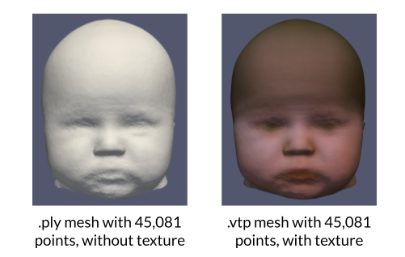
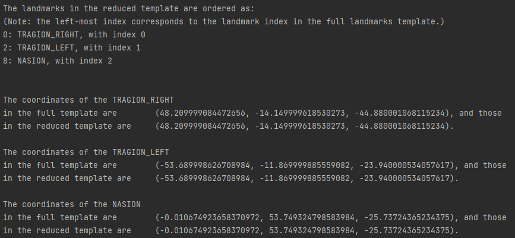
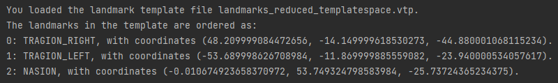
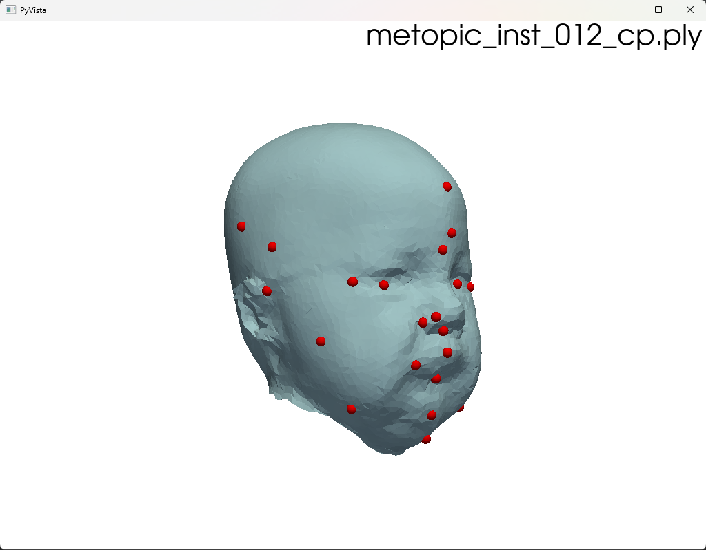
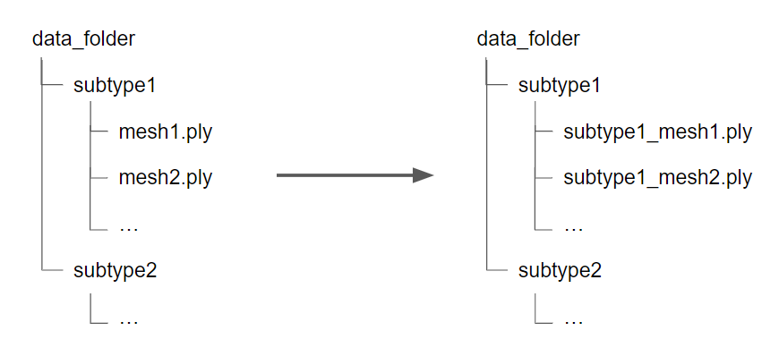

# Implementation of the HSA index at the Erasmus MC
Franz A. Tapia Chaca

franz.tapia-chaca@outlook.com

## <u>Content</u>
Franz's work with the HSA index spanned 4 categories:
1. Appending RGB texture to synthetic meshes
2. Calculating the HSA on synthetic and patient meshes
3. Evaluating the landmarking prediction
4. Converting mesh files from .ply to .vtp format

Each category has its own subdirectory, and how the corresponding scripts work is 
explained below.

## <u>A) Appending RGB texture to synthetic meshes</u>

Within this folder, there is 1 script:

### 1. ``texture_generator.py``

With this script, we can load the synthetic meshes (constituted by 45,081 points) 
and the texture_model.h5 published by Matthias Schaufelberger et al. 
([publication](https://www.mdpi.com/2075-4418/12/7/1516)) to apply unique textures to those meshes.

Given three paths (the path to the texture model, untextured data directory, and the export directory), 
the script works by:
1. Loading the texture model from texture_model.h5.
And then for each mesh:
2. Getting its points and cells,
3. Creating a .vtp mesh object,
4. Generating a texture for the mesh from the PCA model,
5. Writing the texture onto the .vtp object,
6. Creating a directory for exporting the .vtp mesh, and
7. Exporting the .vtp mesh in the export directory.

To run the script, define the three paths at the main call of the script.

## <u>HSA calculation</u>

Within this folder, there are 3 scripts:

### 1. ``create_reduced_landmark_ref.py``

This script loads the existing landmark reference with 27 landmarks, collects the 
names and coordinates of the landmarks of interest, and exports a reduced landmarks
polydata object with the names and coordinates of the landmarks of interest.

Note that the landmarks in the full or reduced template MUST follow this relative
order:
``["TRAGION_RIGHT","SELLION","TRAGION_LEFT","EURYON_RIGHT","EURYON_LEFT","FRONTOTEMPORALE_RIGHT","FRONTOTEMPORALE_LEFT","VERTEX","NASION","GLABELLA","OPISTHOCRANION","GNATHION","STOMION","ZYGION_RIGHT","ZYGION_LEFT","GONION_RIGHT","GONION_LEFT","SUBNASALE","ENDOCANTHION_RIGHT","ENDOCANTHION_LEFT","EXOCANTHION_RIGHT","EXOCANTHION_LEFT","ALAR_RIGHT","ALAR_LEFT","NASALE_TIP","SUBLABIALE","UPPER_LIP"]``
This is the relative order that the 27 points in the landmark reference object follow, 
and PlaceLandmarks() (within Analyse3DPhotogram.py) predicts a landmarks object with
this order.

This order must be kept, as within the function RegisterPatientToTemplate()
(in tools/PhotoAnalysisTools.py), the (x, y, z) coordinates of each landmark 
are collected from both the predicted and template landmark object, one landmark 
at a time. Thus, a pair collected (x, y, z) coordinates must correspond to the same
landmark. These collected landmark coordinates are then used to register the patient sample
to the template.

Thus, if we are interested to get the nasion, and left and right tragion, 
we must reduce the template landmarks with the relative order that these landmarks
originally appear with. This is ensured by the get_reduced_landmarks_n_coords() function
of this script herein.

For example, if we request for the landmarks
``['NASION', 'TRAGION_LEFT', 'TRAGION_RIGHT']``, we get the following output:

After creating a reduced landmark template, we can check it:

Finally, to use the reduced landmark template, it must be defined in ``__init__.py``.

### 1. ``hsa_calculator_synth_meshes.py``

### 2. ``hsa_calculator_patient_pre_n_post_op.py``

### 3. ``run_various_crop_percentages.py``

## <u>Landmark prediction evaluation</u>

Within this folder, there are 2 scripts:

### 1. ``export_landmarks.py``

### 2. ``visualise_landmarks.py``

Generates a window that displays meshes with landmarks. The meshes can be those from the test set of a KDE model.
The landmarks can be those predicted with Elkhill's landmark prediction method.

Three functions are used to generate this functionality:
1. visualise_landmarks_per_mesh: creates the window displaying a mesh and its landmarks. Click 'X' for the next mesh. 
2. get_mesh_ids_per_subtype: gets mesh subtype and id for all meshes in a test set file (file has paths to mesh files). 
3. visualise_landmarks_per_model: receives user input for which model's meshes to display, and whether to display 
the control meshes. 

## <u>.ply to .vtp conversion</u>

### ``conversion-validate.py``

### ``paraview_ply_to_vtp_converter.py``

This is a script that should be executed from the ParaView Python Script Editor.
If you try to execute it from your Python IDE, you may experience errors, even if you install paraview with pip.
ParaView requires its own environment called paraview python (which is installed within the software), 
and understanding how to establish paraview python into your separate python environment is complicated.

To execute this script from the ParaView Python Script Editor, only edit the ply_data_path and 
the vtp_data_path variables.
The ply_data_path should point to a directory with subtypes as subdirectories. 
The .ply meshes should be within those subdirectories
The vtp_data_path should have a similar directory structure, and be empty.

For each mesh of each subtype in ply_data_path, the script will automatically load the .ply mesh and 
export it as .vtp.

Download ParaView from [here](https://www.paraview.org/download/).

To access the ParaView Python Script Editor: Tools / Python Script Editor. Load this script for executing.
Then click: File / Run to execute the script.

### ``ply_to_vtp_converter.py``

## Synthetic data processing

### ``append_subtype_to_filename.py``

See docstring in code for explanation.

## Not a folder, others:

### ``get_file_names.py``

### ``test.py``

### ``texture_writer.py``